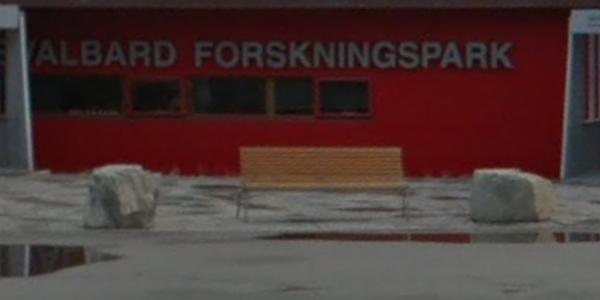

# Exercise 2

```{admonition} Deadline
Please complete this exercise **by the start of the next session**.
```

```{admonition} Support
:class: warning
Please note that **we only provide feedback and support for students enrolled in the course at the University Centre of Svalbard**.
```

Today we focus on the reconstruction of a model of our own.
Split up into separate tasks, we would like you to cover the following goals in groups of 3:

- Image acquisition of an object of your choosing
- SfM photogrammetry of the object you imaged
- Archiving of the dataset in a standardised way
- Documenting the processing steps.

The exercise also includes a deliverable, i.e., a set of requirements that are listed further below.

## Assignment

It is now up to you to head out and acquire your own data set and process this by following the [photogrammetry tutorial](../l1/tutorial "tutorial").

Suggested targets include:

- the boulders in front of UNIS
- small outcrops (ca. 5 m long, 5 m high)



```{admonition} Checklist and questions
:class: note
- [ ] Find a suitable target
- [ ] Take photos of the target
  - [ ] ... from two distances
  - [ ] ... from two angles
  - [ ] ... with photos having at least 80% overlap between them
- [ ] Import the photos to your workstation...
- [ ] ... into the standardised folder structure
- [ ] Create a textured model, saving project into the assigned folder
- [ ] Export a processing report.
- [ ] Fill out the deliverable
```

### Deliverable

At the very least, the following should be completed **prior to the start of the next session**.
Copy it over and send it in to the course responsible.

```
group:
    name:
    person1:
    person2:
    ...
model:
    place: # Where did you find your target?
    region:  # PICK: Hopen / Spitsbergen / Kong Karls Land / Edgeøya / Barentsøya / Tusenøyane / Nordaustlandet / Kvitøya / Prins Karls Forland / Bjørnøya / Other

data:
    package_directory: # FOLDER DIR (absolute, where did you create the standard processing folder structure referred to in the [tutorial]{../l1/tutorial})
    data_directory: #
    overview_img: # FILE DIR (relative to package_directory)
    model_crs:  # INT EPSG number of model CRS
    description_file: "" # create a simple text file with a description, and put it in the package_directory

metadata:
    acquisition_date: # STRING DD.MM.YYYY
    acquisition_type: # PICK Boat / UAV / Handheld / Combination
    acquisition_user: # STRING Data collector
    operator: # STRING Project owner
    acquisition_distance2outcrop: # FLOAT, distance to outcrop
    processing_user: # STRING in charge of processing
    processing_images: # INT number of images used for the model
    processing_calibration: # PICK: Built-in (GPS) / Marker (GPS) / Marker (dGPS) / None
    processing_resolution: # FLOAT resolution in cm/pixel
    processing_quality: # PICK bad / average / good / excellent / None
    tag: # STRING, item separator: ;
    category: # STRING, item separator: ;
```

In addition, everyone will be asked to answer the following questions:

```{warning}
To do, come up with good questinos here
```


```{note}
:class: tip
As for the metadata, you'll only be able to fill out some of the metadata after fully implementing all the steps (and including up to) the meshing and texturing step.
```

```{admonition} Image acquisition
:class: tip
Have a look at the [supplementary information](../suppl/best_practices "suppl") dealing with best practices in photogrammetry.
```

```{admonition} SfM photogrammetry workflow
:class: tip
Have a look at last session's [tutorial](../l1/tutorial "tutorial") for some useful tips and tricks.
```
